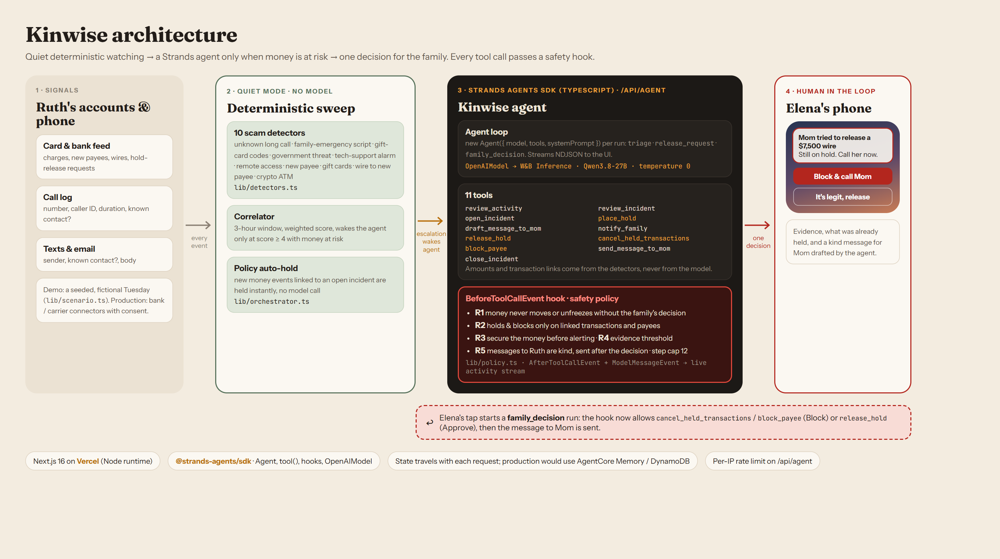

# Kinwise: a quiet guardian for Mom's money

Kinwise is an **Everyday Agent built with the Strands Agents SDK**. It watches an aging parent's card, bank, phone and email activity. While things are normal it stays silent. When a scam starts, it holds the money before it leaves and asks the adult child exactly one question: **Block & call Mom**, or release. The safety rules live in a Strands hook, so the model cannot move money on its own.

**Live demo:** __LIVE_URL__ (press **Play Ruth's day**)
**Pitch slides:** __LIVE_URL__/slides.html
**Track:** Everyday Agents · **License:** MIT



## The problem

- Americans **60 and older reported $7.7 billion in losses** to internet crime in 2025, **about 60% more than in 2024** ([FBI IC3 2025 data, reported by AARP, Apr 16 2026](https://www.aarp.org/money/scams-fraud/fbi-ftc-report-2025-losses/)).
- Fraud losses reported to the FTC by older adults went from **about $600 million in 2020 to $2.4 billion in 2024**, driven by reports of losses over $100,000. People **80 and over had a median reported loss above $1,600** ([FTC, Protecting Older Consumers 2024–2025, Dec 2025](https://www.ftc.gov/news-events/news/press-releases/2025/12/ftc-issues-annual-report-congress-agencys-actions-protect-older-adults)).

The **grandparent scam** is a common version. A "grandson" calls in a panic, a "lawyer" follows, secrecy is demanded, and the victim is pushed into gift cards and a wire, often within an hour. Families usually find out when the money is already gone.

**Who it's for:** adult children who help a parent from another city, and older adults who want to stay independent without handing over their accounts.

## Our solution

In the demo, Ruth (81, Tucson) is watched over for her daughter Elena (Chicago). All people and data are fictional.

1. **Quiet mode, no model.** Every new event goes through 10 deterministic scam detectors (`lib/detectors.ts`). Routine events (groceries, pharmacy, neighbor's text) are simply logged. No LLM call and no notification.
2. **Escalation.** A correlator scores signals in a 3-hour window. A 14-minute call from an unknown number, a "Grandma it's Danny… don't tell Mom" text, a "lawyer" call, then **$1,500 of gift cards** push the score past the threshold. Only then does the app wake the **Strands agent**.
3. **Triage run (Strands).** The agent reviews the evidence, opens an incident, **puts the gift cards on hold**, drafts a kind, non-shaming message for Ruth, and sends Elena **one** notification.
4. **Policy auto-hold.** A new payee and a **$7,500 wire** follow. They are linked to the open incident, so deterministic policy holds the wire instantly, without asking the model.
5. **The critical moment.** With the scammer still on the phone, Ruth asks her bank app to release the wire. The agent calls `release_hold`, and the **Strands `BeforeToolCallEvent` hook blocks it**: money never moves without the family's decision. Elena gets an urgent "call your mom now" update.
6. **The human decides.** Elena taps **Block & call Mom**. A new agent run cancels the held payments, blocks the payee, sends the drafted message to Ruth, and closes the incident. **$9,000 protected.** Kinwise goes back to quiet.

The human stays in charge of the only decisions that matter: whether money moves, and what gets said to Mom.

## How we use the sponsors

### Strands Agents SDK (TypeScript), the core of the product

| What | Where |
| --- | --- |
| `new Agent({ model, tools, systemPrompt })`, one agent per run: `triage`, `release_request`, `family_decision` | [`lib/agent/run.ts`](lib/agent/run.ts) |
| 11 typed tools built with `tool()` + Zod: `review_activity`, `open_incident`, `place_hold`, `draft_message_to_mom`, `notify_family`, `review_incident`, `release_hold`, `cancel_held_transactions`, `block_payee`, `send_message_to_mom`, `close_incident` | [`lib/agent/tools.ts`](lib/agent/tools.ts) |
| **`BeforeToolCallEvent` hook = safety policy.** Every tool call is checked against rules R1–R5 plus a 12-call step cap; a violation sets `event.cancel` with the reason, which the model sees as the tool error | [`lib/policy.ts`](lib/policy.ts), wired in `run.ts` |
| `AfterToolCallEvent` and `ModelMessageEvent` hooks stream tool results, state and agent narration to the UI as NDJSON | `run.ts`, [`app/api/agent/route.ts`](app/api/agent/route.ts) |
| `OpenAIModel` (Strands is model-agnostic): an open model, Qwen3.8-27B, through W&B Inference's OpenAI-compatible endpoint, temperature 0 | `run.ts` |

**Where determinism lives:** detectors decide *when* the agent runs. Tools compute amounts and transaction links from the data, never from model output. The hook decides *what is allowed*. The LLM correlates, explains, words the messages, and sequences the tools.

Safety rules enforced in code:

- **R1** Money never moves or unfreezes without the family's decision
- **R2** Holds and blocks only touch transactions and payees linked to the incident
- **R3** Secure the money before alerting the family
- **R4** Incidents open only when detectors cross the threshold
- **R5** Messages to Ruth must be kind (no shaming language) and are sent only after the family decides

### AWS

Kinwise is built on AWS's open-source Strands Agents SDK. For this submission it is deployed on Vercel, not on Amazon Bedrock AgentCore. Because Strands is portable, the production path is short: run the same agent on **AgentCore Runtime**, keep incidents in **AgentCore Memory** (today the incident state travels with each request), and switch to a Bedrock model by changing the model provider line.

## Try it (about 1 minute)

1. Open the live demo and press **Play Ruth's day**.
2. Watch routine events fade to gray in quiet mode. The scam chain lights up red and the Strands agent's tool calls and hook decisions stream in the dark panel.
3. When Elena's phone buzzes, tap the notification to see the evidence, the holds and the message for Mom.
4. After Ruth's release request is **blocked by the hook**, tap **Block & call Mom** (or **It's legit, release** to see the hook allow the release after approval).
5. **Reset** (↻) restarts the day. No login needed. `?speed=2` plays faster.

## Run locally

Requirements: Node 22+, pnpm.

```bash
pnpm install
cp .env.example .env.local   # then fill in the values
pnpm dev                     # http://localhost:3000
```

`.env.local`:

```
OPENAI_BASE_URL=https://api.inference.wandb.ai/v1   # any OpenAI-compatible endpoint
OPENAI_API_KEY=...
OPENAI_MODEL=Qwen/Qwen3.8-27B
```

Headless end-to-end check of detectors, hook and all three agent runs:

```bash
node --env-file=.env.local --import tsx scripts/smoke-agent.ts block
```

## Project structure

```
app/api/agent/route.ts    Strands agent endpoint (NDJSON stream, per-IP rate limit)
lib/agent/run.ts          Agent, OpenAIModel, hooks, per-run task prompts
lib/agent/tools.ts        11 Strands tools
lib/policy.ts             BeforeToolCall safety policy (R1–R5, step cap)
lib/detectors.ts          10 deterministic scam detectors + correlator
lib/orchestrator.ts       quiet-mode sweep, auto-hold policy, when to wake the agent
lib/scenario.ts           Ruth's fictional Tuesday
components/               feed, agent activity panel, Elena's phone
public/slides.html        4-slide pitch deck (?s=1..4)
docs/architecture.html    architecture diagram source (rendered to docs/architecture.png)
```

## Honest notes

- All people, numbers and messages in the demo are fictional. Holds, blocks and notifications are simulated; a real deployment needs consent-based bank and carrier integrations.
- Incident state is sent with each request, which is fine for a demo. Production would keep it server-side (AgentCore Memory or a database) so a client can't forge a family decision.
- Detectors are transparent rules, not a trained model. That is intentional: they are auditable and they decide when an LLM gets involved at all.
- Built during the hackathon submission period, with Claude Code as a coding assistant. Demo video narration was generated with ElevenLabs.

## License

[MIT](LICENSE)
